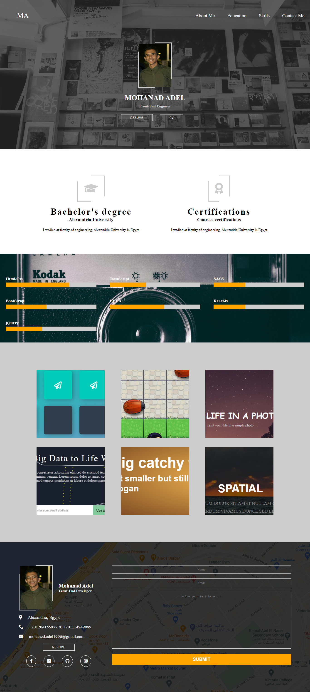

# Mohaned Adel Template


## Preview
you can see it from here https://mohanedadel-template.netlify.app/ 

## Overview 

This is another personal project from my series **Slicing PSDs into responsive UIs** projects.

It was practising on (HTML5, CSS3, JavaScript and Pure Responsive concepts).

## Download

1. Clone Project:
    ```
        $ git clone https://github.com/Mohaned-Adel/mohaned-adel.git
    ```
2. open it:
    open it with your code editor or open the index.html file.

3. enjoy it: 
    Start Hacking

## Template 

<p align="center" style="width: 500px; height: 500px">
    
</p>